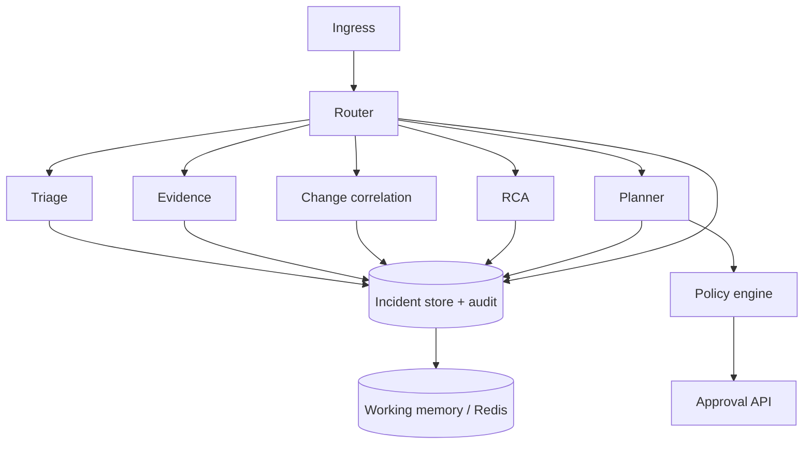

# On-Prem SRE Agent

Self-hosted incident response control plane for on-prem and hybrid estates. It combines FastAPI microservices, a React console, policy-gated execution, optional LLM-backed agents, Postgres, and Redis.

<p align="center">
  <sub>Python 3.9+ · FastAPI · React · Postgres · Redis · OpenTelemetry</sub>
</p>

---

## Features

- **Ingest and normalize** alerts into incidents (`ingress`)
- **Incident store** with persistence and versioning (`incident_store`)
- **Routing workflow** with triage, evidence, RCA, planning, and execution agents (`router`)
- **Policy engine** and **approval API** for gated autonomy
- **Audit trail** for operational events
- **Web console** (Vite + React) with dev proxies to backends
- **Observability**: OTEL-ready services; local collector config under `onprem-sre-agent/k8s/dev/`

## Agentic flow

Production agent stacks often fail in **coordination**, not retrieval: too many tools in one agent, split agents that disagree, sequential handoffs that add latency and drop context, or a single tool registry that becomes a bottleneck. This project follows a **routing + shared state + gated execution** model (the same ideas behind NVIDIA **NemoClaw**-style routing and shared memory): the **router** picks the next workflow and tool plan per incident, every phase reads and writes the **same incident record**, and **policy / approval** separate decisions from side effects.



| Principle | In this repo |
|-----------|----------------|
| **Routing instead of static tool ownership** | `services.router` chooses `next_workflow` and a focused tool plan per step (LLM-assisted hybrid router in `hybrid_router.py`), instead of one monolithic tool dump or fixed agent silos. |
| **Shared memory instead of fragile handoff chains** | `IncidentRecord` in the **incident store** is the source of truth; **Redis hot state / working memory** indexes snippets so agents share context without re-serializing private chat history. |
| **Decoupled reasoning and execution** | Agents and the router **decide**; the **policy engine** and **approval API** **execute** or block privileged actions, reducing premature or unsafe tool use. |

Scale and complexity land on **stable coordination** (router loop, persisted incident graph, audits) rather than on a single overloaded agent or a brittle handoff pipeline.

## Repository layout

```
SRE-Agent-Onprem/
  onprem-sre-agent/          # Application root (pyproject.toml, services, agents, UI)
    services/                # FastAPI apps (ingress, router, store, policy, approval, audit)
    agents/                    # Agent implementations
    adapters/                  # Telemetry / action adapters (stub + extension points)
    libs/                      # Shared contracts, policy, memory, observability, LLM runtime
    ui/console/                # Operator console
    policies/                  # YAML policy assets
    docker-compose.dev.yml     # Postgres, Redis, OTEL collector
    Makefile                   # lint, test, typecheck, replay
```

## Prerequisites

- **Docker** (for local Postgres, Redis, and optional OTEL collector)
- **Python** 3.9 or newer
- **Node.js** 18+ (for the console)

## Quick start

### 1. Infrastructure

From `onprem-sre-agent`:

```bash
docker compose -f docker-compose.dev.yml up -d
```

Wait until Postgres and Redis are healthy.

### 2. Python environment

```bash
cd onprem-sre-agent
python -m venv .venv
```

Activate the venv (Windows PowerShell: `.venv\Scripts\Activate.ps1`), then:

```bash
pip install -e ".[dev]"
alembic upgrade head
```

### 3. Configuration

Copy the example env file and edit **before** sharing or committing anything:

```bash
copy .env.example .env
```

Set at least `POSTGRES_DSN`, `REDIS_URL`, and (if you use cloud LLMs) `LLM_API_KEY`. Never commit real API keys; treat `.env` as secret.

See also `ui/console/.env.example` for optional Vite overrides.

### 4. Run backend services

Six ASGI apps are expected on fixed ports (used by the console and smoke tests):

| Port | Service          | Uvicorn module                    |
|-----:|------------------|-----------------------------------|
| 8001 | Ingress          | `services.ingress.app:app`        |
| 8002 | Incident store   | `services.incident_store.app:app` |
| 8003 | Router (agents)  | `services.router.app:app`         |
| 8004 | Policy engine    | `services.policy_engine.app:app`  |
| 8005 | Approval API     | `services.approval_api.app:app`   |
| 8006 | Audit            | `services.audit.app:app`          |

**Windows:** helper script (starts minimized windows):

```powershell
cd onprem-sre-agent
.\tests\start-backend-services.ps1
```

**Any platform:** run one terminal per service, from `onprem-sre-agent` with your venv active:

```bash
python -m uvicorn services.ingress.app:app --host 127.0.0.1 --port 8001
python -m uvicorn services.incident_store.app:app --host 127.0.0.1 --port 8002
python -m uvicorn services.router.app:app --host 127.0.0.1 --port 8003
python -m uvicorn services.policy_engine.app:app --host 127.0.0.1 --port 8004
python -m uvicorn services.approval_api.app:app --host 127.0.0.1 --port 8005
python -m uvicorn services.audit.app:app --host 127.0.0.1 --port 8006
```

Ensure `CORS_ALLOW_ORIGINS` includes your console origin (default in `.env.example`: `http://localhost:5173`).

### 5. Run the console

```bash
cd onprem-sre-agent/ui/console
npm install
npm run dev
```

Open [http://localhost:5173](http://localhost:5173). The dev server proxies API calls to the backends above.

### 6. Smoke check (optional)

With backends on 8001 and 8003:

```bash
cd onprem-sre-agent
pytest tests/smoke_route_http.py -q
```

## Development

From `onprem-sre-agent`:

| Command         | Description        |
|----------------|--------------------|
| `make lint`    | Ruff               |
| `make test`    | Pytest             |
| `make typecheck` | Mypy (strict)    |
| `make replay`  | Eval replay runner |

Integration-style tests may require `LLM_API_KEY` and network; see `pyproject.toml` pytest markers.

## Kubernetes / OTEL

Sample collector config: `onprem-sre-agent/k8s/dev/otel-config.yaml` (mounted by `docker-compose.dev.yml` for local dev).


